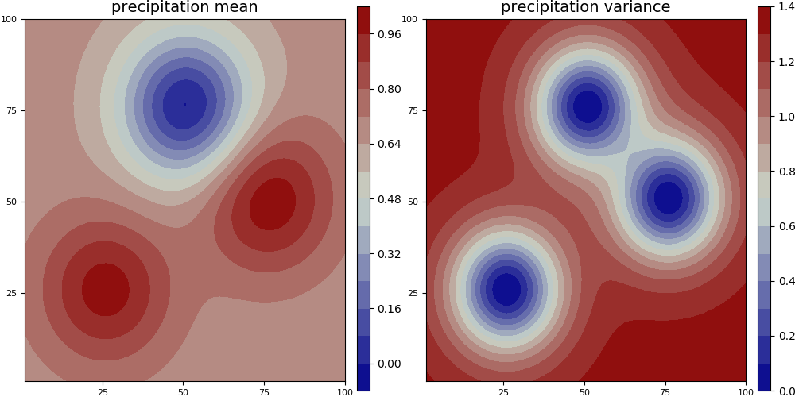

[](https://travis-ci.org/juliohm/GeoStats.jl)
[](http://pkg.julialang.org/?pkg=GeoStats)
[](https://codecov.io/gh/juliohm/GeoStats.jl)
[](https://juliohm.github.io/GeoStats.jl/stable)
[](https://juliohm.github.io/GeoStats.jl/latest)
[](https://github.com/juliohm/GeoStats.jl/blob/master/LICENSE)

*High-performance implementations of geostatistical algorithms for the Julia programming language.*

## Overview

Geostatistics (a.k.a. spatial statistics) is the branch of statistics that deals with
spatial data. In many fields of science, such as mining engineering, hidrogeology,
petroleum engineering, and environmental sciences, traditional regression techniques
fail to capture spatiotemporal correlation, and therefore are not satisfactory tools
for decision making.

GeoStats.jl is an attempt to bring together bleeding-edge research in the geostatistics
community into a comprehensive framework, and to empower researchers and practioners
with a toolkit for fast assessment of different modeling approaches.

The design of this package is the result of many years developing geostatistical software.
I hope that it can serve to promote more collaboration between geostatisticians around the
globe and to standardize this incredible science.

If you would like to help support the project, please
[star the repository on GitHub](https://github.com/juliohm/GeoStats.jl)
and share it with your colleagues. If you are a developer,
please check [GeoStatsBase.jl](https://github.com/juliohm/GeoStatsBase.jl).

## Installation

Get the latest stable release with Julia's package manager:

```julia
Pkg.add("GeoStats")
```

## Project organization

The project is split into various packages:

| Package  | Description |
|:--------:| ----------- |
| [GeoStats.jl](https://github.com/juliohm/GeoStats.jl) | Main package containing Kriging-based solvers, and other geostatistical tools. |
| [GeoStatsImages.jl](https://github.com/juliohm/GeoStatsImages.jl) | Training images for multiple-point geostatistical simulation. |
| [GslibIO.jl](https://github.com/juliohm/GslibIO.jl) | Utilities to read/write *extended* GSLIB files. |
| [GeoStatsBase.jl](https://github.com/juliohm/GeoStatsBase.jl) | Base package containing problem and solution specifications (for developers). |
| [GeoStatsDevTools.jl](https://github.com/juliohm/GeoStatsDevTools.jl) | Developer tools for writing new solvers (for developers). |

The main package (i.e. GeoStats.jl) is self-contained, and provides high-performance
Kriging-based estimation/simulation algorithms over arbitrary domains. Other packages
can be installed from the list above for additional functionality.

## Quick example

Below is a quick preview of the high-level API, for the full example, please see
[Examples](examples.md).

```julia
using GeoStats
using Plots

# data.csv:
#    x,    y,       station, precipitation
# 25.0, 25.0,     palo alto,           1.0
# 50.0, 75.0,  redwood city,           0.0
# 75.0, 50.0, mountain view,           1.0

# read spreadsheet file containing spatial data
geodata = readtable("data.csv", coordnames=[:x,:y])

# define spatial domain (e.g. regular grid, point collection)
grid = RegularGrid{Float64}(100, 100)

# define estimation problem for any data column(s) (e.g. :precipitation)
problem = EstimationProblem(geodata, grid, :precipitation)

# solve the problem with any solver
solution = solve(problem, Kriging())

# plot the solution
plot(solution)
```


### Low-level API

If you are interested in finer control, Kriging estimators
can also be used directly:

```@example
using GeoStats
srand(2017) # hide

# create some data
dim, nobs = 3, 10
X = rand(dim, nobs)
z = rand(nobs)

# target location
xₒ = rand(dim)

# define a variogram model
γ = GaussianVariogram(sill=1., range=1., nugget=0.)

# define an estimator (i.e. build the Kriging system)
simkrig = SimpleKriging(X, z, γ, mean(z))
ordkrig = OrdinaryKriging(X, z, γ)
unikrig = UniversalKriging(X, z, γ, 0)

# estimate at target location
μ, σ² = estimate(simkrig, xₒ)
println("Simple Kriging:") # hide
println("  μ = $μ, σ² = $σ²") # hide
μ, σ² = estimate(ordkrig, xₒ)
println("Ordinary Kriging:") # hide
println("  μ = $μ, σ² = $σ²") # hide
μ, σ² = estimate(unikrig, xₒ)
println("Universal Kriging:") # hide
println("  μ = $μ, σ² = $σ²") # hide
```
